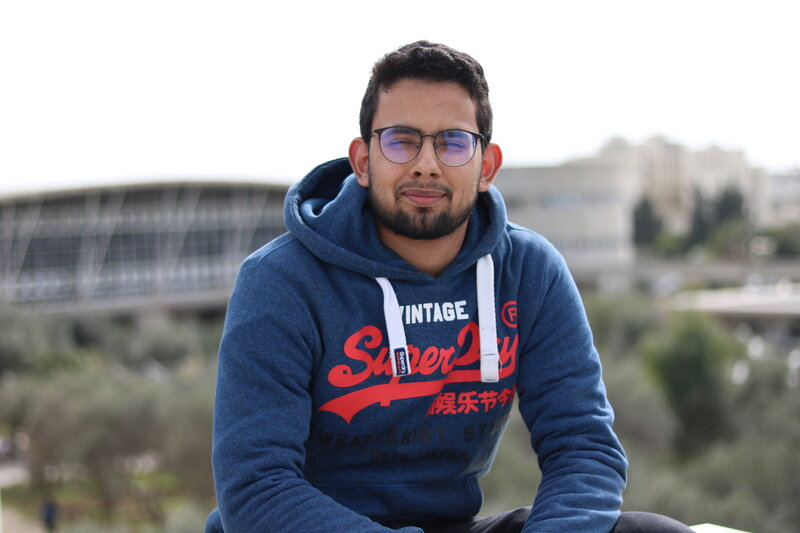

 &nbsp; &nbsp; &nbsp; &nbsp;  &nbsp; &nbsp; &nbsp; &nbsp;  &nbsp; &nbsp; &nbsp; &nbsp;  
# BIOGRAPHIE :
I'm Mohamed Ali Ouachani known also as *IronByte* in community and among my friends. I was born in Tunisia and bla bla bla... etc. Anyway, let's skip to the important part. I have been a *competitive programmer* for quite some time (+5 years)... with some fairly good experience in programming especially in C/C++, Python, and JAVA. I have been also a capture the flag player playing thought out my journey.

# EDUCATION :
I'm a network and telecommunication Student at the National Institute Of Science And Technology Of Tunisia **INSAT**. One more thing to mention, I hate classes so that's why I have been always skipping them.

# I'M INTERESTED IN : 
* Binary Exploitation.
* Programming. 
* Reverse Engineering.

# BACK :
* [Home Page](https://ir0nbyte.github.io/IronByte/).
* [Writeups](https://ir0nbyte.github.io/IronByte/Writeups).
