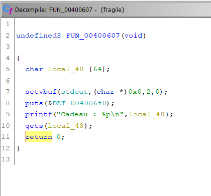

Before we start you need to download the binary from here : [Binary](./fragile).

Here we go let's start by running the binary and see what we have : 

````console
(ironbyte㉿IronByte)-[/mnt/c/Users/IR0NYTE/Desktop/ctf]
└─$ ./fragile
Montrez-nous de quoi vous êtes capable !
Cadeau : 0x7fff8ec7ec20
Asslema ya Hmema
````

As you can see the binary gave us some random memory address with a beautiful hello in *french*. Why don't we start by checking the architecture of the binary with : 
```console
(ironbyte㉿IronByte)-[/mnt/c/Users/IR0NYTE/Desktop/ctf]
└─$ file fragile
```
We got : 

````bash
fragile: ELF 64-bit LSB executable, x86-64, version 1 (SYSV), dynamically linked, interpreter /lib64/ld-linux-x86-64.so.2, for GNU/Linux 3.2.0, BuildID[sha1]=6a457609506482cdebb144dbacd9c1f6fba34955, stripped
````
As we can see the architecture of the binary is 0x64 bit, it's also dynamically linked and not striped. Let's try checking out the mitigations that is ON : 

````console
(ironbyte㉿IronByte)-[/mnt/c/Users/IR0NYTE/Desktop/ctf]
└─$ pwn checksec fragile
````

We got : 

````bash 
[*] '/mnt/c/Users/IR0NYTE/Desktop/ctf/fragile'
    Arch:     amd64-64-little
    RELRO:    Partial RELRO
    Stack:    No canary found
    NX:       NX disabled
    PIE:      No PIE (0x400000)
    RWX:      Has RWX segments
````

So as you can see we have no stack canary protecting the stack from overriding the return of the program, we also have the right to execute code in the stack since the **NX** is disabled. Since this two mitagations are off i was curious a little of bit to know more about this random address that the binary was throwing at me so i fired up my ghidra and started making some analysis on it, here's what i got : 




